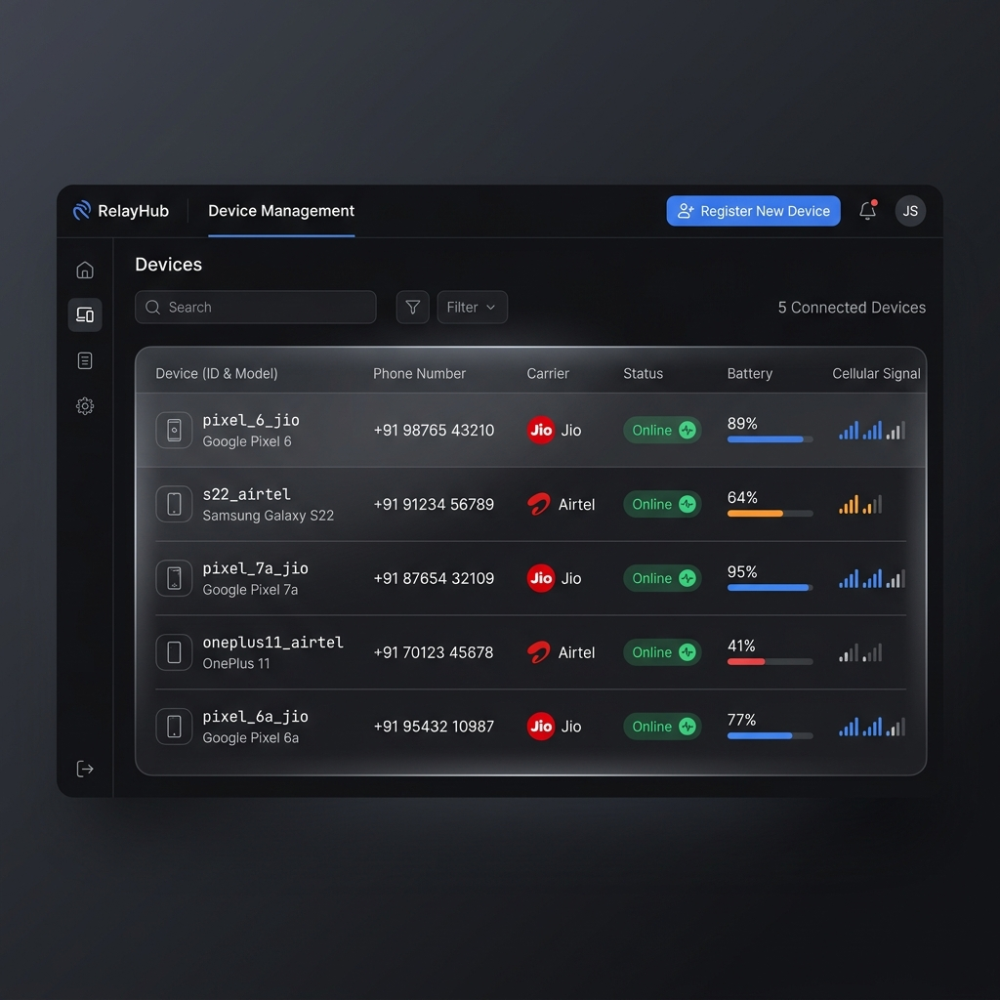
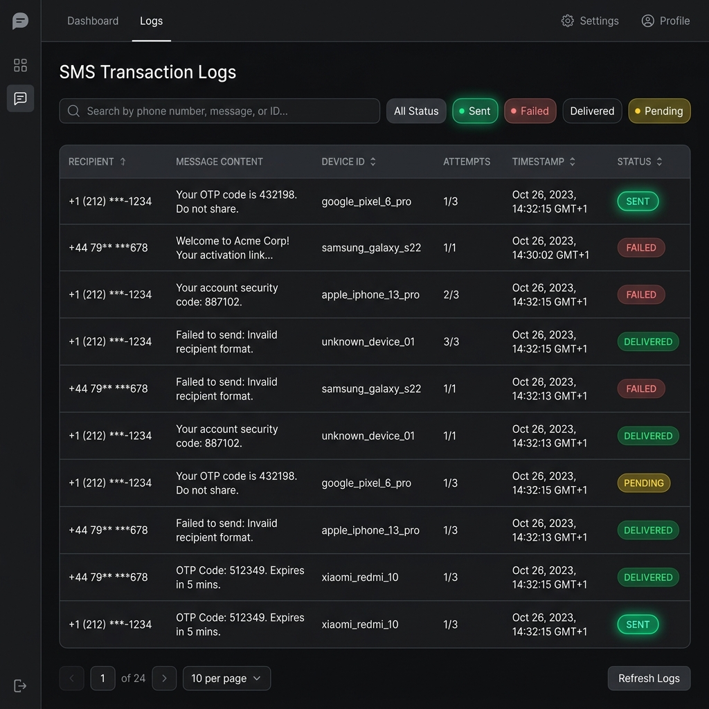
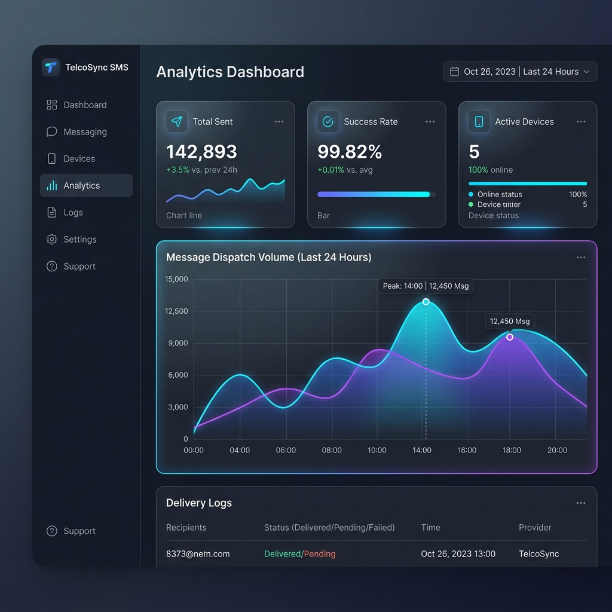
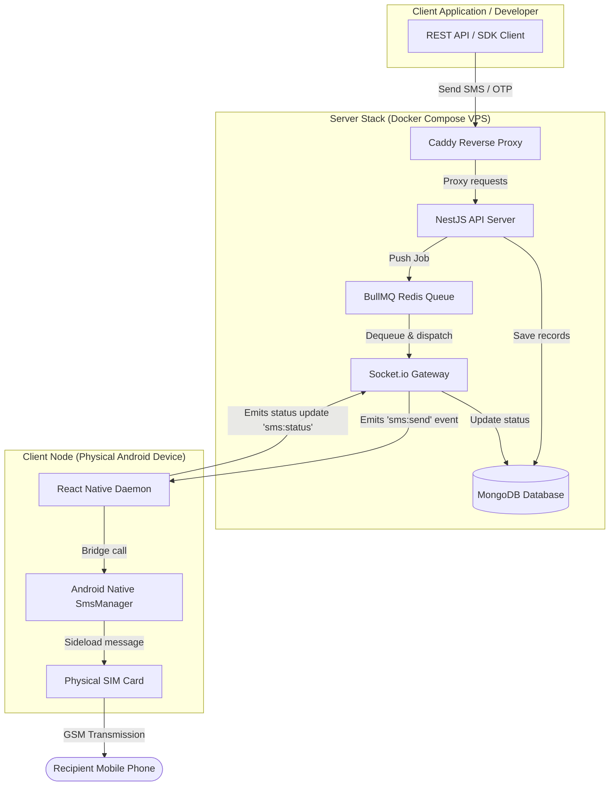

# 📱 SMS Gateway SaaS Platform: Self-Hosted Direct-to-SIM Messaging Infrastructure

[]()
[](./LICENSE)
[]()
[]()
[]()
[]()

A high-performance, self-hosted SMS Gateway SaaS platform that turns Android devices into physical SMS relay nodes. The platform enables developers and businesses to dispatch low-cost transaction messages (OTP, alerts, notifications) using local carrier SIM cards instead of expensive third-party SMS providers like Twilio.

---

## 🖼️ Screenshots & Demo

### Admin Dashboard Overview

*Admin panel displaying real-time delivery performance KPIs, cellular status alerts, and message volume graphs.*

### Connected Devices Gateway

*Live device registry showcasing online status flags, battery indicators, and SIM signal levels.*

### Message Logs & History

*Detailed SMS audit logs featuring server-side pagination, search filtering, and state records.*

### Analytics & Insights

*Visual breakdown of transmission latencies, queue counts, and carrier dispatch success rates.*

### Interactive Walkthrough Demo

*A live animation showing the dashboard triggering an SMS dispatch and the mobile node transmitting it in real-time.*

---

## ✨ Features

* **Direct SIM Card Relay**: Bypasses SMS API aggregators by using native Android telephony API libraries on physical SIM cards.
* **Robust Message Queueing**: Employs [BullMQ](https://github.com/taskforcesh/bullmq) (backed by Redis) to prevent message drops and handle spikes in throughput.
* **Real-Time Device Synchrony**: Employs a Socket.io WebSocket link to handle persistent device connectivity, active socket registry, and live device telemetry.
* **Live Analytics Dashboard**: React dashboard utilizing Recharts to track delivery statistics, OTP ratios, active device signals, and battery states in real-time.
* **OTP Generation & Verification**: Ready-made endpoints featuring automatic 5-minute code expiration, 3-attempt brute-force protection, and phone-level rate limits.
* **Automatic Failure Recovery**: Immediate retry patterns on failure to send, and queue persistence in the event that devices temporarily lose signal.
* **Structured JSON Logging**: Integrates Pino for production-grade structured JSON output, ready for Datadog, ELK, or CloudWatch ingestion.
* **Containerized Deployment**: Clean Caddy proxy configuration with automated HTTPS SSL provisioning and persistent volumes.

---

## 🏗️ System Architecture

This platform consists of three core workloads and a shared packaging layer:



For detailed architectural breakdowns, see the sub-diagrams:
* 👉 [High-Level Architecture](./docs/diagrams/high-level-architecture.md)
* 👉 [SMS Delivery Flow](./docs/diagrams/sms-delivery-flow.md)
* 👉 [Device Registration Flow](./docs/diagrams/device-registration-flow.md)
* 👉 [OTP Verification Flow](./docs/diagrams/otp-verification-flow.md)
* 👉 [Queue Processing Flow](./docs/diagrams/queue-processing-flow.md)
* 👉 [Failure Recovery Flow](./docs/diagrams/failure-recovery-flow.md)
* 👉 [Authentication Flow](./docs/diagrams/authentication-flow.md)

---

## 🛠️ Technology Stack

| Workload / Component | Technology Stack | Role & Functionality |
| :--- | :--- | :--- |
| **Monorepo Engine** | NPM Workspaces, TypeScript (Strict Mode) | Manages package structures, paths, and local dependency sharing. |
| **Backend API Server** | NestJS v11, Express, Passport JWT, Mongoose, Pino Logger | Exposes REST APIs, manages schemas, and routes websocket connections. |
| **Message Queue & Cache** | Redis, BullMQ | Handles job buffering, rate-limiting rules, worker pools, and retries. |
| **Real-time Gateway** | Socket.io (`@nestjs/websockets`) | Holds persistent TCP lines to mobile clients for low-latency dispatch. |
| **Frontend Dashboard** | React v19, Vite, Material UI (MUI v6), TanStack Query, Recharts | Provides the management console interface for administrators. |
| **Mobile Gateway Daemon** | React Native v0.86, Android Native Java Modules, Telephony APIs | Native module bridging JS calls to the Android `SmsManager` system. |
| **Container Infrastructure** | Docker, Docker Compose, Caddy Reverse Proxy (Automatic SSL) | Runs all services inside unified networks with automated Let's Encrypt. |

---

## 🔄 SMS Lifecycle

The system guarantees reliable out-of-band delivery:
1. **Ingestion**: The client calls `POST /api/sms/send`. The NestJS server validates the inputs and saves a database record under `status: pending`.
2. **Buffering**: The job is pushed to the BullMQ Redis queue, transitioning the database record to `status: queued`.
3. **Throttling**: The BullMQ worker pops the job, adhering to a strict **1 SMS every 2 seconds** policy per device, transitioning the status to `status: processing`.
4. **WebSocket Dispatch**: The worker finds the online Socket ID for the device and emits an `sms:send` event.
5. **SIM Transmission**: The Android device receives the payload, invokes Android's native `SmsManager`, and triggers cellular transmission.
6. **Acknowledge**: The phone listens for the cell tower receipt and emits `sms:status` back to the server, completing the lifecycle as `status: sent` or `status: failed`.

For a sequence breakdown, see the [SMS Delivery Diagram](./docs/diagrams/sms-delivery-flow.md).

---

## 🔒 Security

* **Dual Authorization Pipeline**: Supports both JWT Session tokens (for UI operations) and secure SHA-256 hashed API Keys (`x-api-key` header) for automated client integration.
* **API Rate Limiting Protection**: Integrates `nestjs-throttler` to protect against brute-force attacks on `/login` (max 10/min) and API flooding on SMS endpoints.
* **SIM Abuse & Spam Shield**: Includes a custom `PhoneThrottlerGuard` limiting OTP dispatches to a maximum of 3 requests per phone number per 5 minutes.
* **Strict Validation Pipeline**: Input payloads are filtered through class-validator filters (`whitelist: true`) to avoid document injection.

For details, view the [Authentication Architecture Diagram](./docs/diagrams/authentication-flow.md).

---

## 📈 Scalability

* **Mongoose Database Indexing**: Schema files contain indexes on query-intensive properties (`recipient`, `status`, `deviceId`, and `createdAt` descending) to maintain query performance under millions of logs.
* **Carrier rate throttling**: Configured BullMQ worker parameters (`limiter: { max: 1, duration: 2000 }`) to enforce a global delay of 2 seconds between SMS sends, preventing carrier suspension for spam.
* **Decoupled Queue Failover**: Job failures undergo exponential backoff retries, and are stored in the queue error state (acting as a Dead-Letter Queue) upon exhaustion.

For details, see the [Queue Processing Flow Diagram](./docs/diagrams/queue-processing-flow.md).

---

## 🚀 Deployment

### Prerequisites
* **Node.js**: `v22.x` (LTS)
* **Docker & Docker Compose**
* **Android Studio & Physical Device** (with SIM card and cellular network)

### 💻 Local Development Setup

To run database services in the background and run the stack in development watch modes:

#### Step 1: Start Redis and MongoDB containers
```bash
docker compose -f infra/docker-compose.yml up mongodb redis -d
```

#### Step 2: Boot Backend REST API server
```bash
npm run start:dev --workspace=@sms-gateway/backend
```
The backend API is now running locally on: [http://localhost:3000/api](http://localhost:3000/api)
Interactive Swagger API Docs are available at: [http://localhost:3000/api/docs](http://localhost:3000/api/docs)

#### Step 3: Run React Web Dashboard
```bash
npm run dev --workspace=@sms-gateway/dashboard
```
The dashboard UI will launch on: [http://localhost:5173](http://localhost:5173)

#### Step 4: Run React Native Mobile Host
Connect your physical Android device via USB (with USB Debugging enabled) and run:
```bash
npm run android --workspace=@sms-gateway/mobile
```

---

### 🐳 Docker Compose Deployment (Production)

To deploy the entire production stack including the Caddy reverse proxy and automatic HTTPS:

1. Update the Caddyfile in `infra/caddy/Caddyfile` with your domain name.
2. Ensure you have copied and configured all variables inside `.env` in `apps/backend/`.
3. Launch the containerized cluster:
```bash
docker compose -f infra/docker-compose.yml up --build -d
```

---

## 📄 License
This project is licensed under the MIT License - see the [LICENSE](./LICENSE) file for details.
