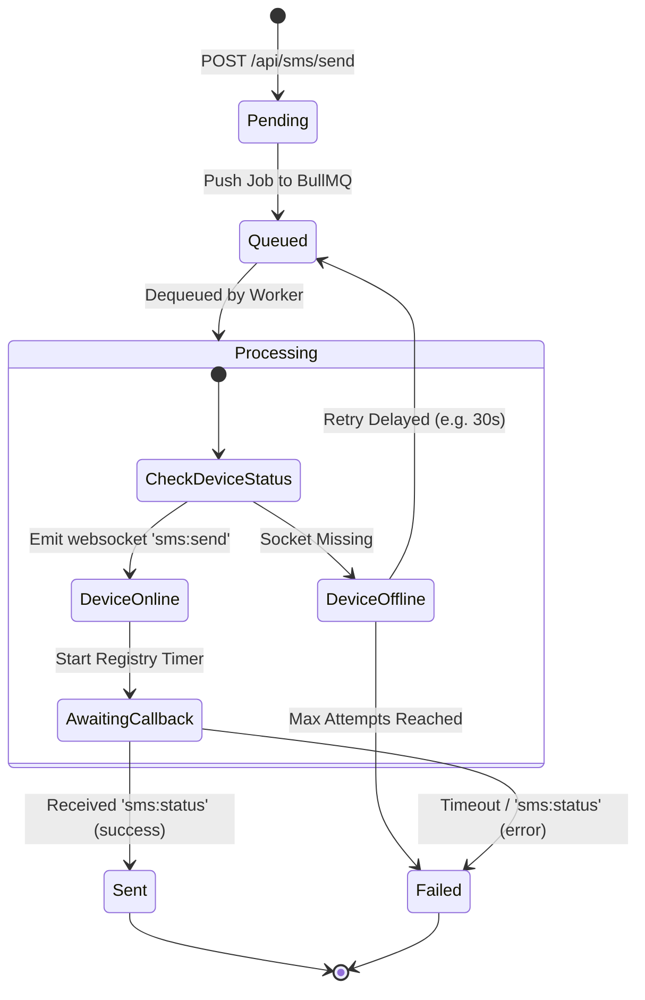
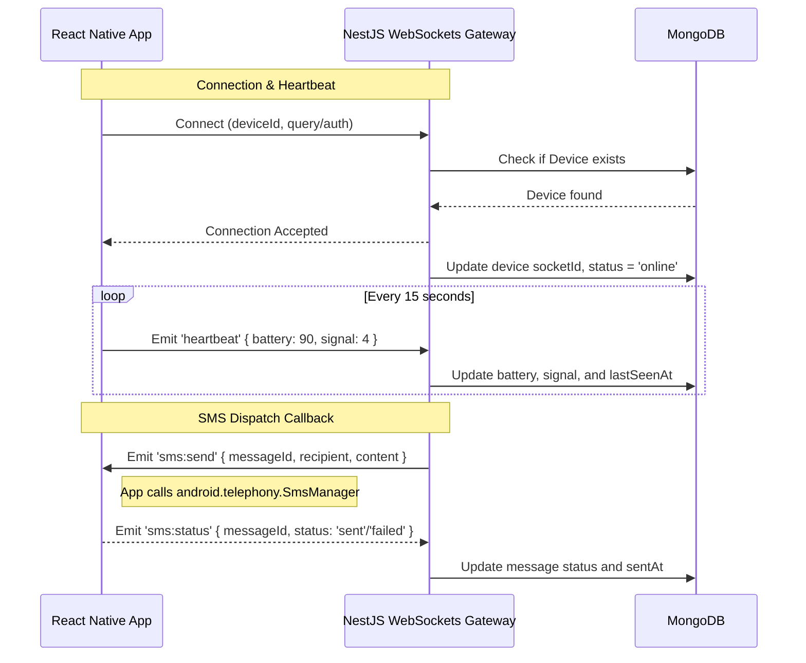
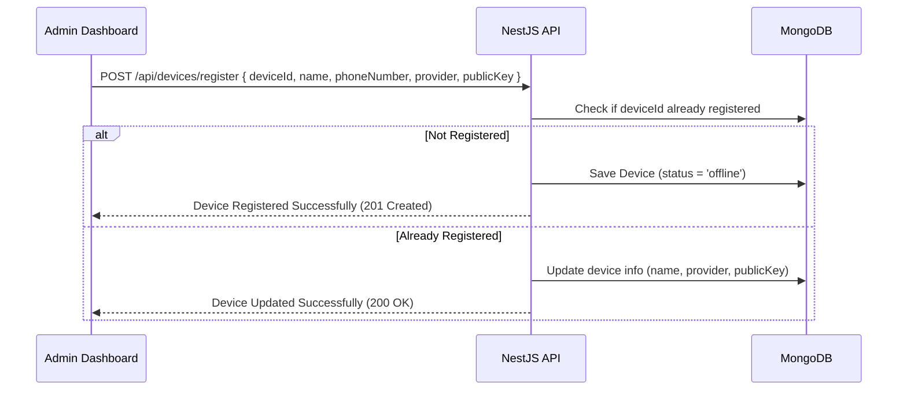
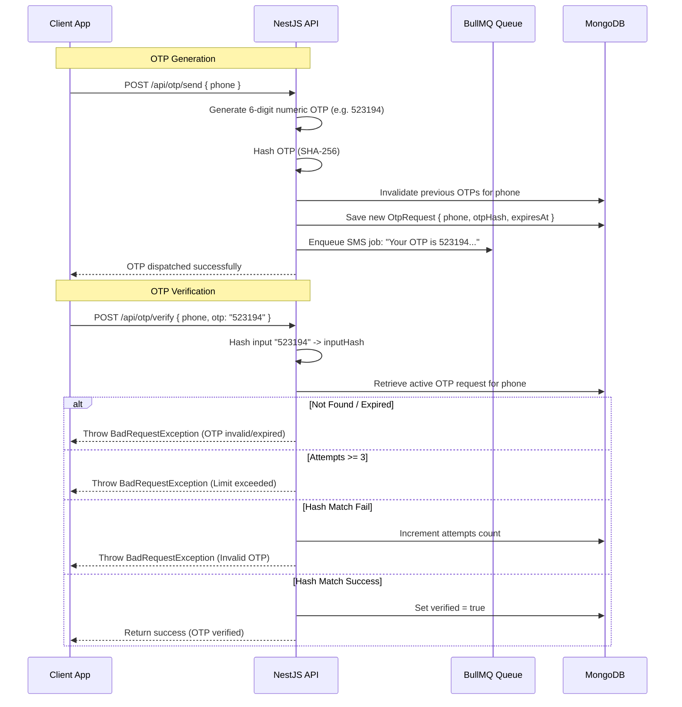

# System Architecture and Design Specification

This document provides a technical deep-dive into the architectural designs, database schemas, message lifecycles, and real-time flows of the SMS Gateway SaaS Platform.

---

## 1. Component Architecture Overview

The system is designed as a distributed, event-driven monorepo split into decoupled services:

```mermaid
graph TD
    subgraph Client Application
        SDK[API Client / Third-party App]
    end

    subgraph Node.js Gateway Layer (Docker Cluster)
        Caddy[Caddy Reverse Proxy]
        API[NestJS HTTP Server]
        WS[Socket.io Gateway]
    end

    subgraph Messaging Queue & Storage
        Redis[(Redis Key-Value Cache)]
        BullMQ[BullMQ Processing Engine]
        DB[(MongoDB Database)]
    end

    subgraph Android Endpoint Nodes
        App[React Native Daemon]
        SIM[Physical SIM Card]
    end

    SDK -- HTTP/JSON requests --> Caddy
    Caddy -- Port 3000 /api --> API
    Caddy -- Port 3000 /socket.io --> WS
    
    API -- Read/Write --> DB
    API -- Push SMS Job --> BullMQ
    BullMQ -- Store State --> Redis
    
    WS -- Emits 'sms:send' --> App
    App -- Reports 'sms:status' --> WS
    App -- Telephony Access --> SIM
```

---

## 2. Database Design (MongoDB Schemas)

The database layers are modeled in MongoDB using Mongoose schemas. The critical collections and their relations are detailed below:

### `users` Collection
Stores admin/user credentials and authorization roles:
```json
{
  "_id": "ObjectId",
  "name": "String",
  "email": "String (Unique, Indexed)",
  "passwordHash": "String",
  "role": "String (admin | user)",
  "refreshTokens": ["String"],
  "createdAt": "Date",
  "updatedAt": "Date"
}
```

### `devices` Collection
Keeps track of registered Android device gateways, hardware IDs, and live socket connection references:
```json
{
  "_id": "ObjectId",
  "deviceId": "String (Unique, Indexed)",
  "name": "String",
  "phoneNumber": "String (E.164 format)",
  "provider": "String (e.g. Jio)",
  "status": "String (online | offline | paused)",
  "battery": "Number (0-100)",
  "signal": "Number (0-4)",
  "socketId": "String (Nullable, Indexed)",
  "publicKey": "String (RSA Public Key)",
  "lastSeenAt": "Date",
  "createdAt": "Date",
  "updatedAt": "Date"
}
```

### `messages` Collection
Tracks every inbound/outbound SMS transactional request:
```json
{
  "_id": "ObjectId",
  "userId": "ObjectId (Ref: users, Indexed)",
  "deviceId": "String (Ref: devices, Nullable, Indexed)",
  "recipient": "String (E.164 format, Indexed)",
  "content": "String",
  "status": "String (pending | queued | processing | sent | failed, Indexed)",
  "errorMessage": "String (Nullable)",
  "attempts": "Number (Default: 0)",
  "maxAttempts": "Number (Default: 3)",
  "sentAt": "Date (Nullable)",
  "createdAt": "Date",
  "updatedAt": "Date"
}
```

### `otp_requests` Collection
Stores OTP requests for phone verification:
```json
{
  "_id": "ObjectId",
  "phone": "String (Indexed)",
  "otpHash": "String (SHA-256)",
  "expiresAt": "Date (Indexed)",
  "attempts": "Number (Default: 0)",
  "verified": "Boolean (Default: false)",
  "createdAt": "Date"
}
```

---

## 3. Message Lifecycle & Queue Processing (BullMQ)

Message sending is asynchronous and managed via [BullMQ](https://github.com/taskforcesh/bullmq) to ensure reliability.



### Queue Processing Flow
1. **Request Ingestion**: The client calls `POST /api/sms/send`. The NestJS controller validates inputs and creates a database document with `status: pending`.
2. **Enqueue**: The backend pushes an execution job containing the database `messageId` into the BullMQ Redis queue. The document status transitions to `status: queued`.
3. **Queue Worker Execution**: The active background worker pops the job and changes the database status to `processing`.
4. **WebSocket Dispatch**: The worker checks the active socket maps in `DevicesGateway`.
   * **If Device is Online**: The server registers a pending callback in `SmsRegistry` and emits an `sms:send` event over the device's WebSocket.
   * **If Device is Offline**: The worker throws an exception, prompting BullMQ to mark the job as failed and schedule a delayed retry.

---

## 4. WebSocket Communication Flow

Real-time device synchronization uses Socket.io to manage client presence and status updates:



---

## 5. Device Registration Flow



---

## 6. OTP Verification Flow

OTP generation uses cryptographic hashing to protect numeric secrets:



---

## 7. Failure Recovery and Retries

The platform implements multi-layer recovery paths to handle common network and hardware failures:

### 1. WebSockets Gateway Disconnection
* **Action**: If a device socket drops, Socket.io client in [App.tsx](file:///e:/Autonomous/files/message-service/apps/mobile/App.tsx) initiates exponential backoff reconnect attempts.
* **Database Sync**: The backend logs the socket disconnect event and marks the device status as `offline`.

### 2. Message Timeout (No Callback Received)
* **Action**: When a job is dispatched to a device, the backend initiates a 30-second callback registry timer (`SmsRegistry`).
* **Trigger**: If the device fails to report back within 30 seconds (due to app crash, memory pressure, or battery exhaustion), the registry rejects the timer.
* **Resolution**: The worker marks the message status as `failed` in the database, triggering a retry event inside BullMQ.

### 3. SIM Carrier Failures (Out of Credits/No Signal)
* **Action**: If the Android native SMS manager fails to send the text message, the app catches the exception and returns `status: failed` containing the carrier's error code.
* **Resolution**: The backend logs the error inside the `errorMessage` column, and BullMQ schedules a retry with a 30-second delay. The system attempts up to 3 retries before marking the message as permanently `failed`.
