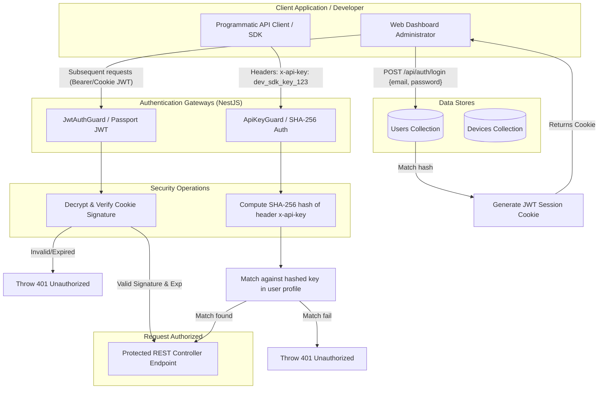

# Authentication Flow

Dual authentication architecture separating admin user dashboard sessions from third-party programmatic API client keys.

### Flow Highlights

- **Bearer Token & HTTP-Only Cookie Support**: Web dashboard utilizes secure token session exchange to protect administrators against Cross-Site Scripting (XSS).
- **Programmatic API Keys**: Developers integration clients use high-throughput custom headers. The database stores SHA-256 hashes of the keys rather than plain-text, ensuring authorization credentials remain secure.
- **Strict Guard Separation**: Controllers isolate endpoints, ensuring mobile endpoints, management consoles, and dispatch API endpoints use the narrowest possible permission scopes.
