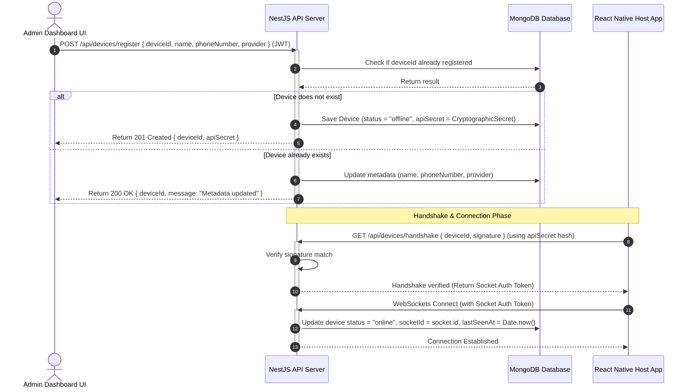

# Device Registration Flow

Securing and enrolling a physical Android device as a message relay node.

### Flow Highlights

- **Pre-Registration**: Devices must be registered on the web dashboard to prevent rogue devices from joining the platform.
- **HMAC / SHA-256 Handshake**: React Native client authenticates itself using a unique signature hashed with the device's shared secret.
- **WebSocket Session Coupling**: Once online, the WebSocket connection binds the client `socketId` to the device document, enabling rapid lookups by the message processor.
