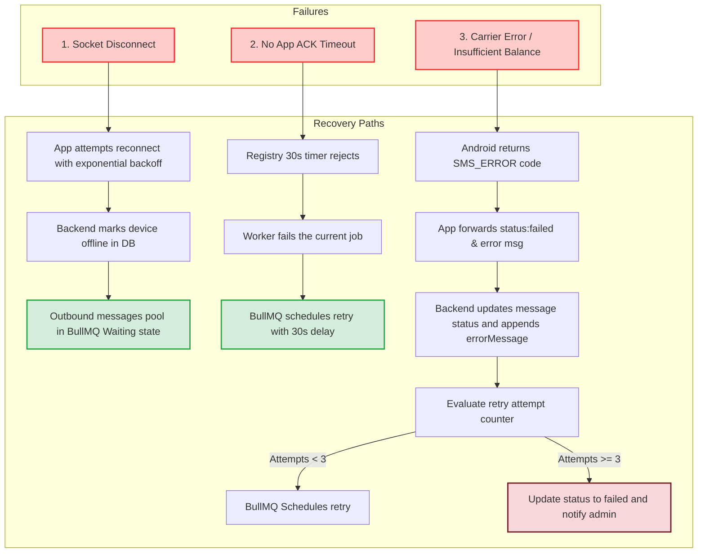

# Failure Recovery Flow

How the system handles physical connection drops, native app restarts, socket timeouts, and carrier outages.

### Flow Highlights

1. **Connection Resilience**: React Native client reconnection routines use random jitter exponential backoff to avoid flooding the WebSockets server on recovery.
2. **Acknowledgment Registry**: Ensures that messages sent to devices that crash mid-delivery are not lost. If no status packet comes back within 30 seconds, the job is failed, returned to Redis, and picked up again.
3. **Verbose Diagnostics**: Native Android failure codes (e.g., `RESULT_ERROR_GENERIC_FAILURE`, `RESULT_ERROR_NO_SERVICE`, `RESULT_ERROR_LIMIT_EXCEEDED`) are propagated back to the database, allowing admins to debug SIM balances or network coverage issues.
