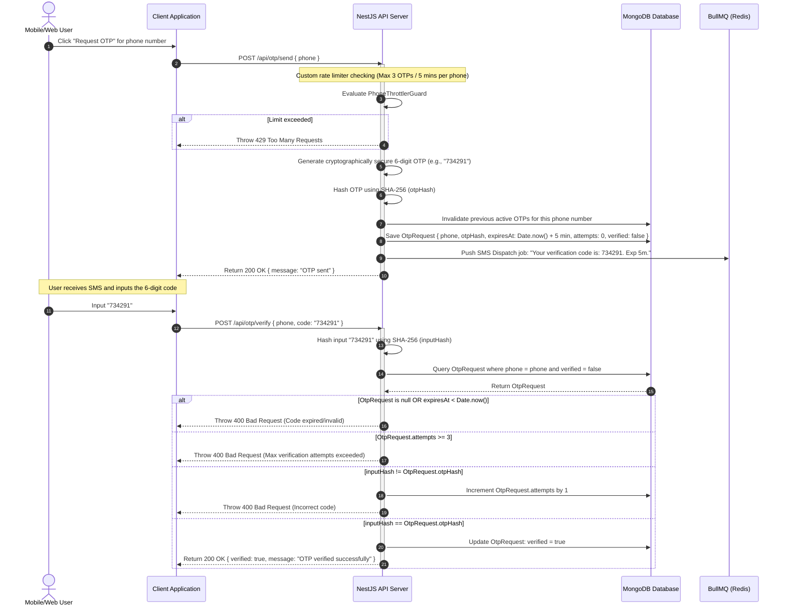

# OTP Verification Flow

Secure, rate-limited One-Time Password generation, delivery, and verification.

### Flow Highlights

- **Brute-Force Shielding**: Storing attempts and limiting verification tries to 3 per code prevents automated script attacks guessing the OTP.
- **SHA-256 OTP Hash Storage**: We do not store raw 6-digit codes in the database, protecting user session logs in the event of database access breaches.
- **PhoneThrottlerGuard**: Prevents SIM flooding and SMS bill exhaustion by rate-limiting OTP triggers using the phone number body parameter instead of IP addresses.
