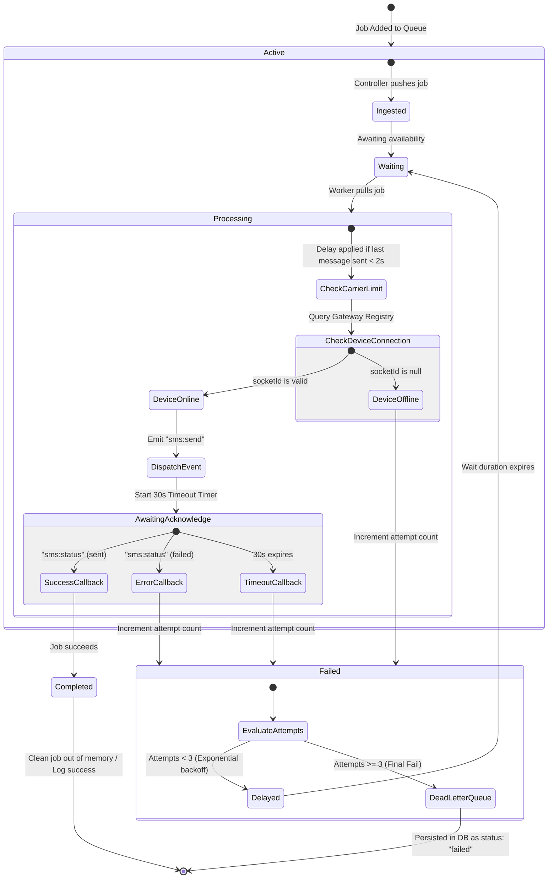

# Queue Processing Flow

Detailed lifecycle of an SMS dispatch job inside the BullMQ Redis queue cluster.

### Flow Highlights

- **Rate-Limited Workers**: Workers enforce spacing of jobs to avoid carrier blocks, ensuring a safe gap of 2 seconds per physical SIM node.
- **Out-of-Band Retries**: If devices drop offline, the job goes back to the wait state without failing the transaction globally.
- **Dead-Letter Sync**: Messages that exhaust all 3 retries update the MongoDB status to `failed` and record the last observed error message, acting as the system's Dead-Letter Queue.
