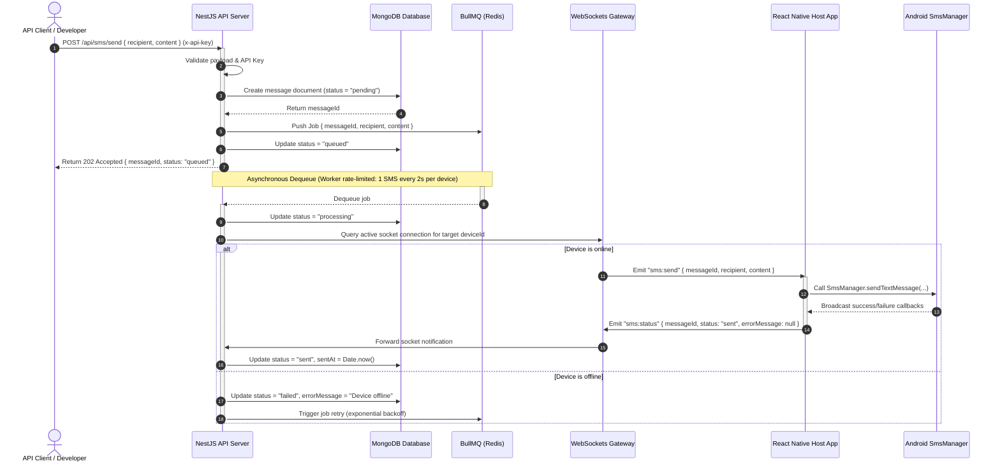

# SMS Delivery Flow

The sequence of operations required to send a text message from a client API call down to the physical SIM transmission.

### Flow Highlights

- **HTTP Status 202 Accepted**: Immediately returned to the developer to avoid blockings. The SMS delivery is processed out-of-band.
- **Worker Level Rate Limiting**: Ensures that even under peak traffic, the queue worker delays dispatching to the WebSockets gateway to match the 2-second rate limit, avoiding carrier flags.
- **Bidirectional WebSocket Update**: Real-time status update feeds back from Android's hardware listener directly to the dashboard records.
