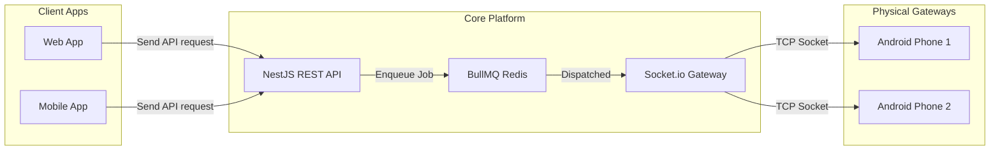

# Engineering Case Study: Direct-to-SIM SMS Gateway SaaS Platform

This document serves as a technical portfolio case study detailing the engineering lifecycle, core system bottlenecks, and architectural decisions made while building the SMS Gateway SaaS platform.

---

## 1. Executive Summary

### The Business Problem
Modern applications rely heavily on SMS for OTP verification, transaction alerts, and notifications. Using traditional API aggregators (e.g. Twilio, Vonage) incurs high volume-based billing costs ($0.0079+ per SMS in the US, and varying international rates). For startups and high-volume developers, these costs scale linearly and rapidly drain margins.

### The Solution
A secure, self-hosted SMS Gateway platform that turns low-cost consumer SIM cards (sideloaded into Android devices) into SMS relay nodes. The system acts as a private, high-capacity Twilio alternative. Applications communicate with our central NestJS backend using standard REST APIs or API keys, which routes messages through WebSocket channels to an active mobile gateway device for direct carrier transmission.

---

## 2. Core Technical Challenges & Solutions

### Challenge 1: Asynchronous Dispatch & Backpressure Management
* **Problem**: Triggering bulk SMS broadcasts via HTTP requests is slow. The backend must ingest requests immediately without blocking connection threads, and must avoid overwhelming the client Android devices (which can only send 1 SMS every 1–2 seconds due to carrier limits and radio constraints).
* **Solution**: Implemented an event-driven queueing pipeline using **BullMQ** and **Redis**. Incoming API requests write message records to MongoDB and immediately queue job references. Decoupled worker processes consume these jobs at a rate matched to the hardware's capacity, managing throttle limits and prevent job drop-outs.

### Challenge 2: Real-time Device Synchronization & Connection Resilience
* **Problem**: Mobile devices frequently experience network drops, IP changes, or sleep-mode interruptions. The system must maintain accurate device statuses and recover instantly when nodes disconnect.
* **Solution**: Developed a persistent WebSocket link using **Socket.io**. The mobile client sends telemetry heartbeats (battery charge, carrier signal, and connection strength) every 15 seconds. If a connection drops, the backend registers the disconnection and redirects or buffers pending messages in the BullMQ queue until reconnect events occur.

### Challenge 3: Monorepo Scope and Module Resolution
* **Problem**: Managing a NestJS API, a React dashboard, a React Native mobile app, and three shared TypeScript packages in a monorepo introduces dependency conflicts. Specifically, React Native's Metro bundler struggled to resolve hoisted devDependencies (e.g. `@babel/runtime`) and duplicated React instances, causing runtime hook dispatcher exceptions.
* **Solution**: Structured custom dependency isolation within [apps/mobile/metro.config.js](file:///e:/Autonomous/files/message-service/apps/mobile/metro.config.js). Configured custom `watchFolders` and a custom `resolveRequest` resolver hook to force Metro to redirect all duplicate module queries back to a single shared root node_modules directory.

---

## 3. High-Impact Architecture Decisions

### 1. Unified TypeScript Monorepo
* **Context**: Shared typings are crucial for API consistency.
* **Impact**: Created `@sms-gateway/types` to share models (User, Device, Message, OTP) across all workloads. Changing a field in the core database model updates compile-time validation in both the NestJS server and React Dashboard automatically, preventing schema drift.

### 2. Hashed API Key Authentication
* **Context**: Traditional token logins are unsuitable for backend-to-backend integrations.
* **Impact**: Built an API Key validation guard that performs SHA-256 hashing. The database only stores key hashes, preventing database leaks from exposing active client credentials, matching security standards of companies like Stripe.

### 3. Automatic SSL & TLS Reverse Proxy (Caddy)
* **Context**: Production SaaS tools require secure transport layers (HTTPS).
* **Impact**: Utilized Caddy as a Dockerized reverse proxy to serve static dashboard bundles and route traffic to the NestJS API. Caddy handles Let's Encrypt certificate generation out-of-the-box, ensuring zero-downtime certificate rotation.

---

## 4. Scalability and Failure Mode Analysis

| Failure Mode | Impact | Mitigation Strategy |
| :--- | :--- | :--- |
| **Android Device Disconnection** | Outbound messages fail to deliver. | The NestJS Socket Gateway monitors connection drops, updating device status to `offline`. BullMQ retains pending messages, allowing them to remain in the queue and retry automatically once the device reconnects. |
| **SIM Out of Balance/Carrier Lock** | Mobile app throws delivery errors. | The React Native app catches native Android `SmsManager` exceptions and emits detailed failure codes back to the WebSocket. The server logs the error, increments the retry attempt counter, and alerts the admin via the Dashboard. |
| **High API Traffic Spikes** | Server memory and database strain. | BullMQ buffers incoming traffic. Multiple queue workers can be run concurrently to scale message ingestion, while MongoDB indexes ensure fast read/write lookups on hot fields like `recipient` and `status`. |

---

## 5. Key Engineering Lessons Learned

1. **Native Platform Integrations Require Resiliency**: Working with native hardware modules (like Android's `SmsManager`) means accepting hardware variance. We learned to design systems around a "fail-soft" pattern where physical errors do not block backend API operations.
2. **Metro Resolution Limitations in NPM Workspaces**: Metro is not designed for monorepos out-of-the-box. Configuring custom symlinks and overriding path resolvers is essential when writing React Native applications in a shared monorepo workspace.
3. **Queueing is Crucial for Hardware Interfaces**: Synchronous HTTP calls are brittle when interacting with real-world physical devices. Decoupling request ingestion from physical execution via a persistent queue (like BullMQ) is vital to build reliable, high-performance systems.
